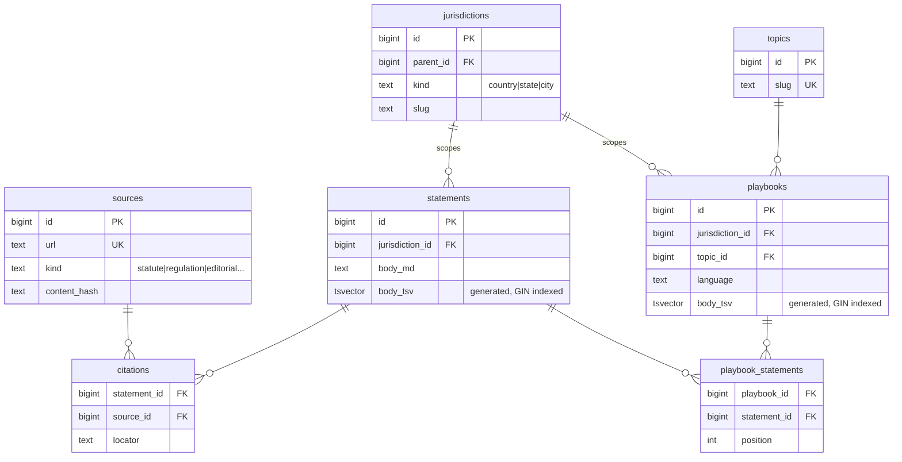

# Defensive Renting

A tool that helps renters understand their rights in plain English.

---

## Problem

Tenant law is public. Most renters don't benefit from it because the information is scattered across city statutes, state codes, and agency websites — written for lawyers, not for someone who just got a notice to quit.

Legal aid organizations do this translation work one call at a time. This project tries to do it at scale.

---

## What it is

Defensive Renting is an early MVP: a web app that lets renters look up their rights by city and situation. Every piece of guidance traces to a real primary source — statute, regulation, or government document — so users can verify what they're reading and bring it to a conversation with a lawyer or housing advocate.

---

## Approach

Content is authored in structured markdown and ingested into a Postgres database. Each claim is attached to at least one cited source at the schema level — there's no path to publishing a statement without a citation. The app serves that content through jurisdiction- and topic-scoped playbooks with full-text search.

The current corpus covers Boston. The schema is designed to expand to other cities without structural changes.

---

## Design principles

- **Clarity over completeness.** A short, accurate answer is better than an exhaustive one that a stressed renter won't finish reading.
- **Citations are not optional.** Every claim links to a primary source. If something can't be cited, it doesn't ship.
- **Honest about limits.** Editorial guidance (practical advice not traceable to a single statute) is labeled distinctly. The app never pretends to give legal advice.
- **Actionable by default.** Guidance is framed around what the renter can actually do, not just what the law says.

---

## MVP features

- Browse playbooks by city and topic (e.g. Boston → Notice to Quit)
- Full-text search across statements and playbooks
- Inline citation chips linking to primary sources
- Distinct labeling for editorial guidance vs. statutory sources
- Health and readiness endpoints

---

## Architecture



Go HTTP server, PostgreSQL, server-rendered HTML. A separate ingest CLI parses markdown content into the database. Full-text search runs through Postgres `tsvector` — no external search service. Deployed on Fly.io with auto-stop machines.

The schema uses a self-referential jurisdictions table so a query for Boston automatically inherits Massachusetts and federal rules. A nullable `embedding` column on statements leaves the door open for semantic search without a future migration.

Tenant law changes on the timescale of legislative sessions, not days. Pages are served with aggressive HTTP caching (`Cache-Control: public, max-age=86400`) — the server rarely needs to render the same page twice. `sources.content_hash` is stored so a future background job can detect when upstream statutes change and flag affected statements for editorial review.

Design decisions and tradeoffs are documented in [`docs/DESIGN.md`](docs/DESIGN.md) and [`docs/ADRs/`](docs/ADRs/).

---

## Adding a new jurisdiction

Content lives in `content/<city-slug>/` as one markdown file per topic per language. Adding a city means writing those files, deploying, and running ingest. No schema changes required.

### 1. Create the content files

Each file follows this structure:

```
content/
  seattle/
    seattle-cant-pay-rent.en.md
    seattle-heat-not-working.en.md
    ...
```

File name convention: `<topic-slug>.<lang>.md`. Use the city slug as a prefix on the topic slug to keep topics globally unique (e.g. `seattle-cant-pay-rent`, not `cant-pay-rent`).

### 2. File format

Every file has a YAML frontmatter block followed by one statement per paragraph:

```markdown
---
jurisdiction: seattle
topic: seattle-cant-pay-rent
language: en
title: "Can't Pay Rent in Seattle — What Are My Options?"
intro: "One or two sentences framing the situation for the renter."
sources:
  - id: wa-rcw-5918057
    url: "https://app.leg.wa.gov/RCW/default.aspx?cite=59.18.057"
    publisher: "Washington State Legislature"
    jurisdiction: washington
    kind: statute
    locator: "RCW 59.18.057"
  - id: seattle-renter-guide
    url: "https://www.seattle.gov/rentinginseattle/renters"
    publisher: "City of Seattle"
    jurisdiction: seattle
    kind: gov_guidance
    locator: ""
---

Washington law requires a landlord to serve a written notice before starting eviction for nonpayment. [wa-rcw-5918057]

Contact your landlord in writing as soon as you know you will miss a payment. Early documentation helps. [editorial]
```

**Frontmatter fields**

| Field | Required | Notes |
|---|---|---|
| `jurisdiction` | yes | Slug of the city (e.g. `seattle`). Must be lowercase, hyphenated. |
| `topic` | yes | Slug for this playbook. Prefix with city slug to avoid collisions. |
| `language` | no | Defaults to `en`. Use ISO 639-1 codes (`es`, `zh`, etc.). |
| `title` | yes | Shown as the playbook heading. |
| `intro` | no | Short framing paragraph shown above the statements. |
| `sources` | yes | At least one source is required. |

**Source `kind` values**: `statute`, `regulation`, `gov_guidance`, `nonprofit`, `editorial`

**Citation syntax**

End each statement paragraph with one or more citation tokens. The parser rejects any prose paragraph without a citation — there is no way to publish an uncited claim.

```
[source-id]            — cites the source using its frontmatter locator
[source-id:Section 5]  — overrides the locator for this statement only
[editorial]            — marks practical advice not traceable to a single statute
```

Multiple citations on one statement: `[wa-rcw-5918057] [editorial]`

### 3. Deploy and ingest

```bash
fly deploy --no-cache          # rebuilds the image with the new content baked in
fly ssh console --app defensiverenting -C "/ingest -content /content"
```

`--no-cache` is necessary because Depot sometimes serves stale content layers from its build cache.

The ingest command is idempotent — re-running it on existing content is safe.

---

## Future work

- Expand to additional cities
- Wizard-style intake ("what's your situation?") to route users to the right playbook
- Semantic search over the cited corpus
- Organization accounts so local tenant groups can contribute and maintain content for their jurisdiction
- Prometheus metrics and structured tracing

---

## Disclaimer

This is not legal advice. If you are facing eviction or a housing dispute, contact a lawyer or your local legal aid organization.
