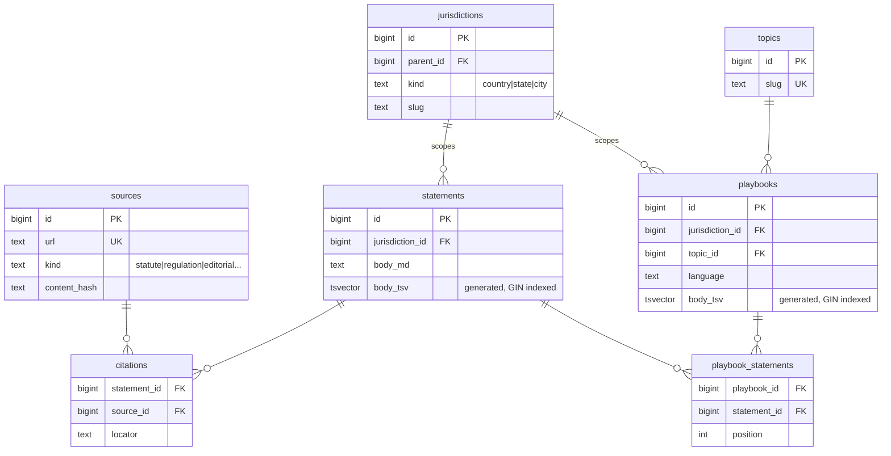

A backend system for a tenant rights platform that turns complex housing law into clear, source-backed guidance.

Content is authored in structured Markdown, ingested into PostgreSQL, and served through jurisdiction with built-in full-text search. The system is designed to support SEO, analytics, and future legal-aid integration workflows.

**MVP:** https://defensiverenting.fly.dev/

## Problem
Tenant law is public, but can difficult for renters to navigate. Information is fragmented across statutes, regulations, and one-off websites, and is usually written for lawyers or legal professionals.

Legal aid and local tenant organizations often do this translation work one jurisdiction at a time. This project defines the pipeline that lays the groundwork to make that process scalable.

## How it works

Renters can search by city and situation. Each page provides guidance backed by a primary source cited in line so users can verify what they’re reading and use it in conversations with lawyers or housing advocates. 

_Disclaimer: Not legal advice._

## Design principles

- **Citations enforced at the data level** — there is no path to publishing an uncited claim  
- **Structured legal data model** enables consistent, queryable guidance across jurisdictions  
- **Clear separation of statutory vs. editorial guidance**  
- **Designed for actionability**, not just legal completeness

## MVP features

- Browse playbooks by city and topic (e.g. Boston → Notice to Quit)
- Full-text search across statements and playbooks
- Inline citation chips linking to primary sources
- Health and readiness endpoints

See [`docs/DESIGN.md`](docs/DESIGN.md) and [`docs/ADRs/`](docs/ADRs/) for full design decisions and tradeoffs. 

### Data Model

The schema uses a self-referential jurisdictions table so a query for Boston automatically inherits Massachusetts and federal rules. A nullable `embedding` column on statements leaves the door open for semantic search without a future migration. 

### Stack

Go HTTP server, PostgreSQL, server-rendered HTML. A separate ingest CLI parses markdown content into the database for now. Full-text search runs through Postgres `tsvector`, so no external search service needed. Deployed on Fly.io.

## Future work (ordered by priority)

- SEO optimization and metadata gen
- Wizard-style intake flows ("what's your situation?") to route to the correct playbook
- Tailwind CSS
- Adding additional cities and jurisdictions
- Language translation and localization support
- Improved search:
  - ranked full-text search
  - snippet highlighting
  - filtering by city and topic
  - semantic/vector retrieval over the cited corpus so renters can ask questions in plain English and land on the correct playbook

## Very future work
- Organization accounts so local tenant groups can contribute and maintain jurisdiction-specific content
- Editorial workflows, versioning, and citation validation pipelines 
- Prometheus metrics, structured tracing, and operational dashboards

---

## _Disclaimer_

_This is not legal advice. If you are facing eviction or a housing dispute, contact a lawyer or your local legal aid organization._
