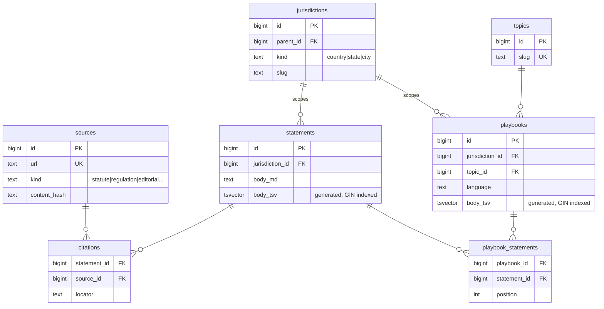

# Defensive Renting

A tool that helps renters understand their rights in plain English.

---

## Problem

Tenant law is public. Most renters don't benefit from it because the information is scattered across city statutes, state codes, and agency websites — written for lawyers, not for someone who just got a notice to quit.

Legal aid organizations do this translation work one call at a time. This project tries to do it at scale.

---

## What it is

Defensive Renting is an early MVP: a web app that lets renters look up their rights by city and situation. Every piece of guidance traces to a real primary source — statute, regulation, or government document — so users can verify what they're reading and bring it to a conversation with a lawyer or housing advocate.

---

## Approach

Content is authored in structured markdown and ingested into a Postgres database. Each claim is attached to at least one cited source at the schema level — there's no path to publishing a statement without a citation. The app serves that content through jurisdiction- and topic-scoped playbooks with full-text search.

The current corpus covers Boston. The schema is designed to expand to other cities without structural changes.

---

## Design principles

- **Clarity over completeness.** A short, accurate answer is better than an exhaustive one that a stressed renter won't finish reading.
- **Citations are not optional.** Every claim links to a primary source. If something can't be cited, it doesn't ship.
- **Honest about limits.** Editorial guidance (practical advice not traceable to a single statute) is labeled distinctly. The app never pretends to give legal advice.
- **Actionable by default.** Guidance is framed around what the renter can actually do, not just what the law says.

---

## MVP features

- Browse playbooks by city and topic (e.g. Boston → Notice to Quit)
- Full-text search across statements and playbooks
- Inline citation chips linking to primary sources
- Distinct labeling for editorial guidance vs. statutory sources
- Health and readiness endpoints

---

## Architecture

Go HTTP server, PostgreSQL, server-rendered HTML. A separate ingest CLI parses markdown content into the database. Full-text search runs through Postgres `tsvector` — no external search service. Deployed on Fly.io with auto-stop machines.

The schema uses a self-referential jurisdictions table so a query for Boston automatically inherits Massachusetts and federal rules. A nullable `embedding` column on statements leaves the door open for semantic search without a future migration.

Design decisions and tradeoffs are documented in [`docs/DESIGN.md`](docs/DESIGN.md) and [`docs/ADRs/`](docs/ADRs/).

---

## Future work

- Expand to additional cities
- Wizard-style intake ("what's your situation?") to route users to the right playbook
- Semantic search over the cited corpus
- Organization accounts so local tenant groups can contribute and maintain content for their jurisdiction

---

## Disclaimer

This is not legal advice. If you are facing eviction or a housing dispute, contact a lawyer or your local legal aid organization.
