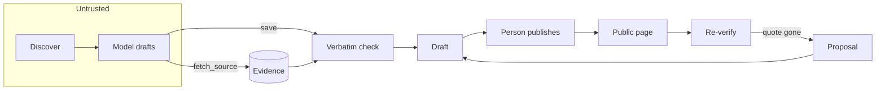
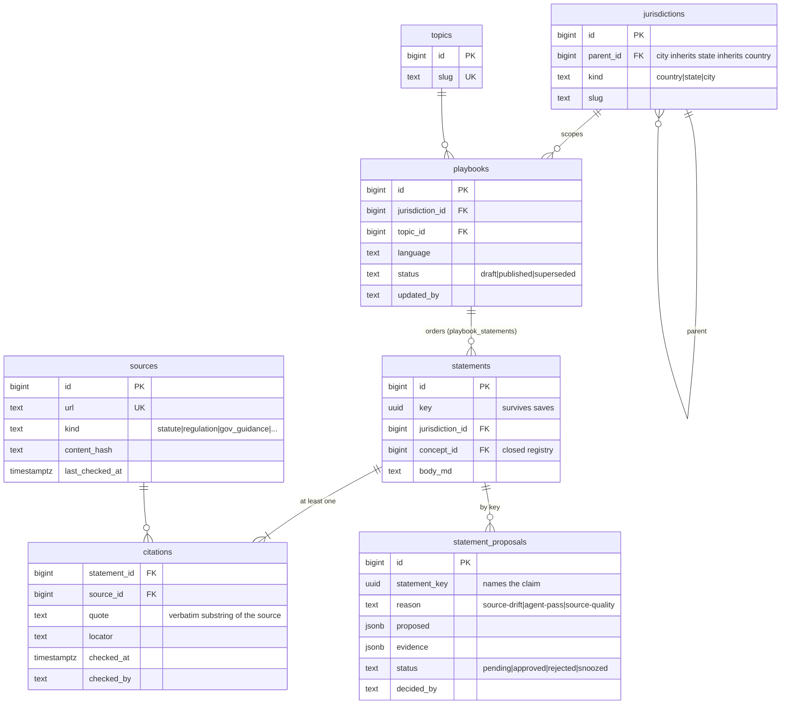

**RenterLaw** — free tenant rights hub with citation-backed guides, primary source links, and local resource directories organized by city and situation. (Repo/internal codename: Defensive Renting; the authoring service keeps that identity.)

https://renterlaw.org

## What it is

Tenant law is public, but nearly impossible to navigate when you're in a stressful situation. It's fragmented across statutes, regulations, and government PDFs — written for lawyers, not renters.

Defensive Renting turns that raw legal material into structured, plain-language guides. Every statement on the site links directly to its primary source — a statute, ordinance, or government document — so renters can read what the law actually says, not just what someone summarized. The platform also includes local resource directories pointing to legal aid providers, tenant unions, and housing agencies.

Drafts are produced by an AI research agent and human-reviewed before publishing: a citation is saved only if its quote appears **verbatim** in a fetched primary source, and nothing goes live without a human.

## Design principles

- **Citations enforced at the data level** — the drafting tool and the publish gate both refuse an uncited claim
- **Structured legal data model** enables consistent, queryable guidance across jurisdictions
- **Clear separation of statutory vs. editorial guidance**
- **Designed for actionability**, not just legal completeness

## How it works

Renters search by situation or browse by city. Each playbook provides step-by-step guidance backed by inline citation chips — click any chip to read the actual statute. A separate directory page type lists local organizations with their official sources.

Content is authored through an internal tool that enforces citation at submission time. No statement goes live without a citation attached.

## How a claim gets published

The product is a pipeline and a data model. The pipeline turns a fetched primary source into a published claim. The data model is what makes the claim checkable after it is published.

One rule holds the whole thing together. A claim reaches the public only if every citation carries a quote that is a verbatim substring of text the system itself fetched, a person confirmed that quote against its source, and a person published the page.

```mermaid
flowchart LR
    subgraph untrusted [Untrusted]
        D[Discover] --> M[Model drafts]
    end
    M -- fetch_source --> E[(Evidence)]
    M -- save --> S[Verbatim check]
    E --> S
    S --> R[Draft]
    R --> P[Person publishes]
    P --> L[Public page]
    L --> V[Re-verify]
    V -- quote gone --> Q[Proposal]
    Q --> R
```

The model is never believed. It sits above a trust boundary and the only thing that crosses is a tool call. The one tool that writes checks each quote against text the system fetched itself and refuses with a fix the model can act on. The same tools run in the Go loop (`cmd/draft`) and over MCP (`cmd/mcp`), so the loop can also be driven from Claude Code.

Publishing is a human act. The authoring tool runs the gate inside the publish transaction: every statement cited, every quote confirmed by a named person. Drafts save freely and the gate refuses, so nothing is lost and nothing leaks.

After publishing, a checker refetches every cited source and confirms each quote still appears. Every fetch carries a receipt (which tier and extractor produced the text, its hash) and every confirmation stores that receipt with the passage around the quote. A later check compares against that baseline: an equal hash is unchanged, a script shell or bot-check page is "could not read here" rather than drift, and a quote confirmed under pdftotext is never declared missing by the weaker pure-Go PDF reader. Only a readable, comparable fetch that lacks the quote files a proposal against the statement's durable key, showing the old passage beside the nearest new one. A person approves, edits, or rejects it. Approval is just a save, so the same gate holds.

## Stack

- **Go** — single binary per service, ~12MB images, ~1.5s cold starts on Fly.io
- **PostgreSQL** — full-text search via `tsvector` (no external search service), `content_hash` on sources for change detection
- **Server-rendered HTML** — no JS framework; the authoring tool uses vanilla JS for its dynamic form
- **Fly.io** — two apps: public site (`fly.toml`) and internal authoring service (`fly.authoring.toml`), auto-deployed via GitHub Actions
- **AI drafting** — an Anthropic-API tool-use agent (`cmd/draft`, `internal/draftagent`) researches sources and writes citation-verified drafts
- **MCP** — the same drafting toolbelt is exposed as an MCP server (`cmd/mcp`), so the research→draft loop can be driven from an editor like Claude Code
- **Cloudflare Worker** — reader reports ("this org closed", "this is out of date") and general contact go to a Worker on its own hostname (`cloudflare/forms`), with Turnstile, D1, and Email Routing. Spam never reaches the origin, and unverified reader text never enters the content database

## Data model

Seven tables carry that rule. A citation is a quote, not a link. A statement has a key that survives every save, so a proposal can name it. A playbook has one live row and at most one draft per slot. Jurisdictions are self-referential, so a query for Boston inherits Massachusetts and federal rules.

```mermaid
erDiagram
    jurisdictions {
        bigint id PK
        bigint parent_id FK "city inherits state inherits country"
        text kind "country|state|city"
        text slug
    }
    topics {
        bigint id PK
        text slug UK
    }
    playbooks {
        bigint id PK
        bigint jurisdiction_id FK
        bigint topic_id FK
        text language
        text status "draft|published|superseded"
        text updated_by
    }
    statements {
        bigint id PK
        uuid key "survives saves"
        bigint jurisdiction_id FK
        bigint concept_id FK "closed registry"
        text body_md
    }
    citations {
        bigint statement_id FK
        bigint source_id FK
        text quote "verbatim substring of the source"
        text locator
        timestamptz checked_at
        text checked_by
    }
    sources {
        bigint id PK
        text url UK
        text kind "statute|regulation|gov_guidance|..."
        text content_hash
        timestamptz last_checked_at
    }
    statement_proposals {
        bigint id PK
        uuid statement_key "names the claim"
        text reason "source-drift|agent-pass|source-quality"
        jsonb proposed
        jsonb evidence
        text status "pending|approved|rejected|snoozed"
        text decided_by
    }

    jurisdictions ||--o{ jurisdictions : "parent"
    jurisdictions ||--o{ playbooks : "scopes"
    topics ||--o{ playbooks : ""
    playbooks ||--o{ statements : "orders (playbook_statements)"
    statements ||--|{ citations : "at least one"
    sources ||--o{ citations : ""
    statements ||--o{ statement_proposals : "by key"
```

Known gaps, stated plainly:

- Fetched text is not persisted. It lives in memory for the run, so a checked_at stamp cannot yet show the text it was checked against.
- Every path that confirms a quote (drafting guardrail, authoring form, checker, queue approval, wayback repoint) matches with the one `drafting.QuoteAppearsIn` and records the same receipt, so "checked" means one thing everywhere.
- Two maintenance commands, promote and ingest, write through the same save path but skip the publish gate.

## Roadmap

### Source change monitoring
Shipped as the re-verify loop above (ADR-014). What remains is a cadence: today the checker runs on demand from the command line or a dashboard button, not on a schedule.

### Jurisdiction expansion
Adding cities is the main growth lever. The authoring tool already supports creating new jurisdictions; the bottleneck is research time, not infrastructure.

### Semantic search
The `embedding` column on statements is already in the schema. Adding a vector index (pgvector) and an embedding step in the ingest pipeline would let renters describe their situation in plain English and land on the right playbook without knowing the legal term for it.

### Language localization
The data model stores `language` on playbooks. A second pass of authoring in Spanish (or other languages) would use the same infrastructure with no schema changes.

---

_Not legal advice. If you are facing eviction or a housing dispute, contact a lawyer or your local legal aid organization._
