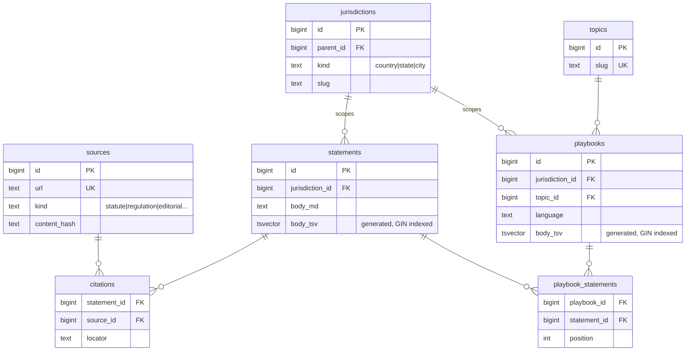

**Defensive Renting** — free tenant rights hub with citation-backed guides, primary source links, and local resource directories organized by city and situation.

https://defensiverenting.fly.dev

## What it is

Tenant law is public, but nearly impossible to navigate when you're in a stressful situation. It's fragmented across statutes, regulations, and government PDFs — written for lawyers, not renters.

Defensive Renting turns that raw legal material into structured, plain-language guides. Every statement on the site links directly to its primary source — a statute, ordinance, or government document — so renters can read what the law actually says, not just what someone summarized. The platform also includes local resource directories pointing to legal aid providers, tenant unions, and housing agencies.

Content is researched and written by a human author using a custom internal authoring tool, not generated.

## Design principles

- **Citations enforced at the data level** — there is no path to publishing an uncited claim
- **Structured legal data model** enables consistent, queryable guidance across jurisdictions
- **Clear separation of statutory vs. editorial guidance**
- **Designed for actionability**, not just legal completeness

## How it works

Renters search by situation or browse by city. Each playbook provides step-by-step guidance backed by inline citation chips — click any chip to read the actual statute. A separate directory page type lists local organizations with their official sources.

Content is authored through an internal tool that enforces citation at submission time. The author researches primary sources, writes plain-language statements, and links each one to its statute or ordinance before it can be published. No statement goes live without a citation attached.

## Stack

- **Go** — single binary per service, ~12MB images, ~1.5s cold starts on Fly.io
- **PostgreSQL** — full-text search via `tsvector` (no external search service), `content_hash` on sources for change detection
- **Server-rendered HTML** — no JS framework; the authoring tool uses vanilla JS for its dynamic form
- **Fly.io** — two apps: public site (`fly.toml`) and internal authoring service (`fly.authoring.toml`), auto-deployed via GitHub Actions

## Data model

The schema uses a self-referential jurisdictions table so a query for Boston can inherit Massachusetts and federal rules. A nullable `embedding` column on statements leaves the door open for semantic search without a future migration.

```mermaid
erDiagram
    jurisdictions {
        bigint id PK
        bigint parent_id FK
        text kind "country|state|city"
        text slug
    }
    sources {
        bigint id PK
        text url UK
        text kind "statute|regulation|editorial..."
        text content_hash
    }
    statements {
        bigint id PK
        bigint jurisdiction_id FK
        text body_md
        tsvector body_tsv "generated, GIN indexed"
    }
    citations {
        bigint statement_id FK
        bigint source_id FK
        text locator
    }
    topics {
        bigint id PK
        text slug UK
    }
    playbooks {
        bigint id PK
        bigint jurisdiction_id FK
        bigint topic_id FK
        text language
        tsvector body_tsv "generated, GIN indexed"
    }
    playbook_statements {
        bigint playbook_id FK
        bigint statement_id FK
        int position
    }

    jurisdictions ||--o{ statements : "scopes"
    jurisdictions ||--o{ playbooks : "scopes"
    sources ||--o{ citations : ""
    statements ||--o{ citations : ""
    statements ||--o{ playbook_statements : ""
    playbooks ||--o{ playbook_statements : ""
    topics ||--o{ playbooks : ""
```

## Roadmap

### Source fetching and author assist
When the author adds a source URL in the authoring tool, the service fetches and stores the page content alongside the source record. The author sees the fetched text in a side panel while writing statements — no tab-switching to read the law. Fetched content is stored in Postgres; `content_hash` already exists in the schema for change detection.

### Source change monitoring
A scheduled crawler re-fetches all cited sources on a cadence (weekly or on-demand). If the content hash changes, the source is flagged in the authoring dashboard for the author to review. The author can dismiss the flag (no material change) or open the diff and update affected statements. Government statute pages do change — rent control thresholds, notice periods, penalty amounts — and this is the mechanism that keeps the site accurate over time.

### Jurisdiction expansion
Adding cities is the main growth lever. The authoring tool already supports creating new jurisdictions; the bottleneck is research time, not infrastructure.

### Semantic search
The `embedding` column on statements is already in the schema. Adding a vector index (pgvector) and an embedding step in the ingest pipeline would let renters describe their situation in plain English and land on the right playbook without knowing the legal term for it.

### Language localization
The data model stores `language` on playbooks. A second pass of authoring in Spanish (or other languages) would use the same infrastructure with no schema changes.

---

_Not legal advice. If you are facing eviction or a housing dispute, contact a lawyer or your local legal aid organization._
