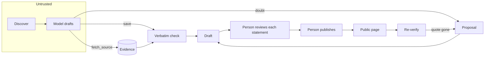
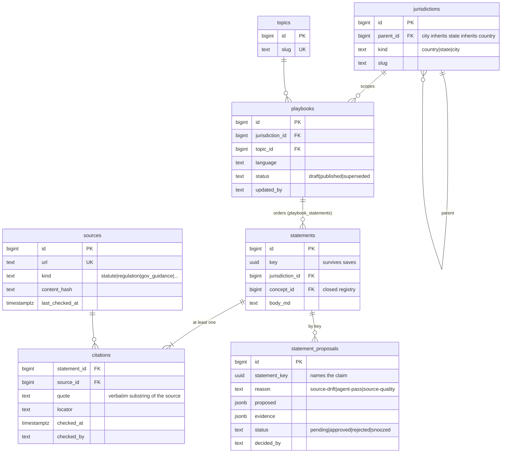

**RenterLaw** is a free tenant rights site: plain-language guides, each sentence backed by a quote from the law it rests on, and local directories of who can help. Organized by city, state, and situation.

https://renterlaw.org

Repo and internal codename: Defensive Renting.

## What a renter gets

Tenant law is public and nearly unreadable in a crisis. It is spread across statutes, regulations, and agency PDFs written for lawyers.

RenterLaw turns that into guides a renter can act on. Each guide is a short sequence of statements. Each statement carries a citation chip; click it and you are reading the statute, not a summary of it. Directory pages list the legal aid offices, tenant unions, and agencies for that place, cited to their own sites.

Renters search by situation or browse by place. A city page inherits its state's rules and the federal ones, so Boston shows Massachusetts law without repeating it.

## How a claim gets published

One rule: a claim reaches the public only if every citation carries a quote that is a verbatim substring of text the system itself fetched, a person confirmed that quote, and a person published the page.

```mermaid
flowchart LR
    subgraph untrusted [Untrusted]
        D[Discover] --> M[Model drafts]
    end
    M -- fetch_source --> E[(Evidence)]
    M -- save --> S[Verbatim check]
    E --> S
    S --> R[Draft]
    M -- doubt --> Q
    R --> W[Person reviews each statement]
    W --> P[Person publishes]
    P --> L[Public page]
    L --> V[Re-verify]
    V -- quote gone --> Q[Proposal]
    Q --> R
```

A model drafts. It sits above a trust boundary and the only thing that crosses is a tool call. The one tool that writes checks every quote against text the system fetched and refuses with a fix the model can act on. The model records anything it is unsure of as a note on that statement. The same tools run in the Go loop (`cmd/draft`) and over MCP (`cmd/mcp`), so drafting can be driven from Claude Code.

A person reviews, one statement at a time. Publishing runs the gate inside the transaction: every statement cited, every quote confirmed, every statement stamped by a person. Drafts save freely; the gate only refuses publishing.

After publishing, a checker re-fetches every cited source and confirms each quote still appears. Every fetch carries a receipt: which tier and extractor produced the text, and its hash. A quote that is gone from a readable, comparable fetch becomes a proposal against the statement, old passage beside new. A person decides. Approval is a save, so the gate holds again.

## The authoring service

The authoring service is where drafts become published pages. A reviewer opens a page and works through its statements in order, reading each one against the quotes that support it. Marking a statement done records that a person read it with its evidence: any quote the checker never confirmed is attested under the reviewer's name, the model's notes on that statement are recorded as read, and the statement is stamped over a hash of its words and citations, so any later edit voids the stamp. Once every statement on a page has been reviewed, the page can be published.

Sources can be read without leaving the page. The fetched text opens alongside the statements with the cited passage highlighted, and a reviewer can select a different passage to use as the quote. Statements can be edited in place, and the full editor handles adding, removing, and reordering them.

The same statements can also be reviewed across pages: grouped by source, so a quote is confirmed once for every page that cites it; grouped by concept, so one claim can be read as each state makes it; or narrowed to the statements the model flagged as uncertain. The dashboard shows how much review each page has left and can publish every finished draft at once, each through the same gate.

## Stack

- **Go**, one binary per service, about 12 MB images, cold starts around 1.5 s on Fly.io
- **PostgreSQL**, full-text search with `tsvector`, no external search service
- **Server-rendered HTML**, vanilla JS only where the authoring form needs it
- **Fly.io**, two apps: the public site (`fly.toml`) and the authoring service (`fly.authoring.toml`), deployed by GitHub Actions on push
- **Anthropic API** tool-use agent for drafting (`cmd/draft`, `internal/draftagent`), also exposed as an MCP server (`cmd/mcp`)
- **Cloudflare Worker** for reader reports and contact (`cloudflare/forms`): Turnstile, D1, Email Routing. Unverified reader text never enters the content database

## Data model

Seven tables carry the rule. A citation is a quote, not a link. A statement has a key that survives every save, so a proposal or a stamp can name it. A playbook has one live row and at most one draft per slot. Jurisdictions nest, so a city inherits its state and country.

```mermaid
erDiagram
    jurisdictions {
        bigint id PK
        bigint parent_id FK "city inherits state inherits country"
        text kind "country|state|city"
        text slug
    }
    topics {
        bigint id PK
        text slug UK
    }
    playbooks {
        bigint id PK
        bigint jurisdiction_id FK
        bigint topic_id FK
        text language
        text status "draft|published|superseded"
        text updated_by
    }
    statements {
        bigint id PK
        uuid key "survives saves"
        bigint jurisdiction_id FK
        bigint concept_id FK "closed registry"
        text body_md
    }
    citations {
        bigint statement_id FK
        bigint source_id FK
        text quote "verbatim substring of the source"
        text locator
        timestamptz checked_at
        text checked_by
    }
    sources {
        bigint id PK
        text url UK
        text kind "statute|regulation|gov_guidance|..."
        text content_hash
        timestamptz last_checked_at
    }
    statement_proposals {
        bigint id PK
        uuid statement_key "names the claim"
        text reason "source-drift|agent-pass|source-quality"
        jsonb proposed
        jsonb evidence
        text status "pending|approved|rejected|snoozed"
        text decided_by
    }

    jurisdictions ||--o{ jurisdictions : "parent"
    jurisdictions ||--o{ playbooks : "scopes"
    topics ||--o{ playbooks : ""
    playbooks ||--o{ statements : "orders (playbook_statements)"
    statements ||--|{ citations : "at least one"
    sources ||--o{ citations : ""
    statements ||--o{ statement_proposals : "by key"
```

Known gaps:

- Fetched text is not persisted. The receipt records its hash and the passage around each quote, not the whole page.
- Two maintenance commands, promote and ingest, write through the same save path but skip the publish gate. A page they publish is stamped whole by the person running them.

## Roadmap

- **Checker cadence.** The re-verify loop runs on demand, from the command line or a button. It should run on a schedule.
- **More places.** Adding a city or state is research time, not infrastructure.
- **Semantic search.** The `embedding` column exists. A vector index and an embedding step would let renters describe a situation in their own words.
- **Spanish.** The plumbing is built and parked until there is a reviewer for it.

---

_Not legal advice. If you are facing eviction or a housing dispute, contact a lawyer or your local legal aid organization._
