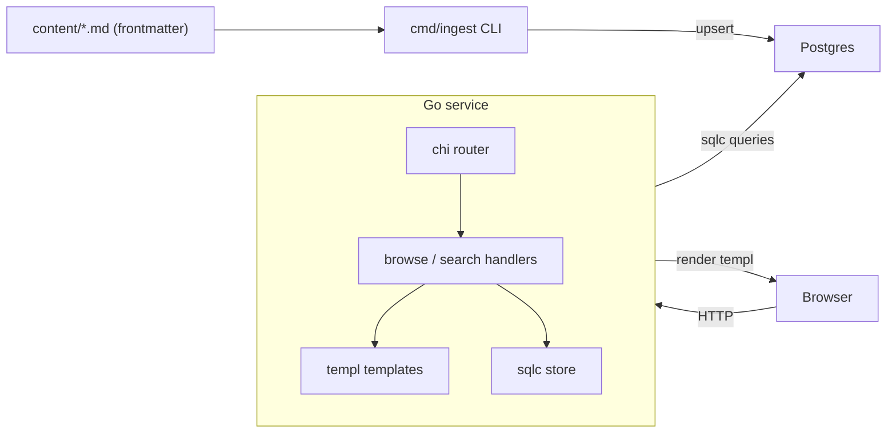
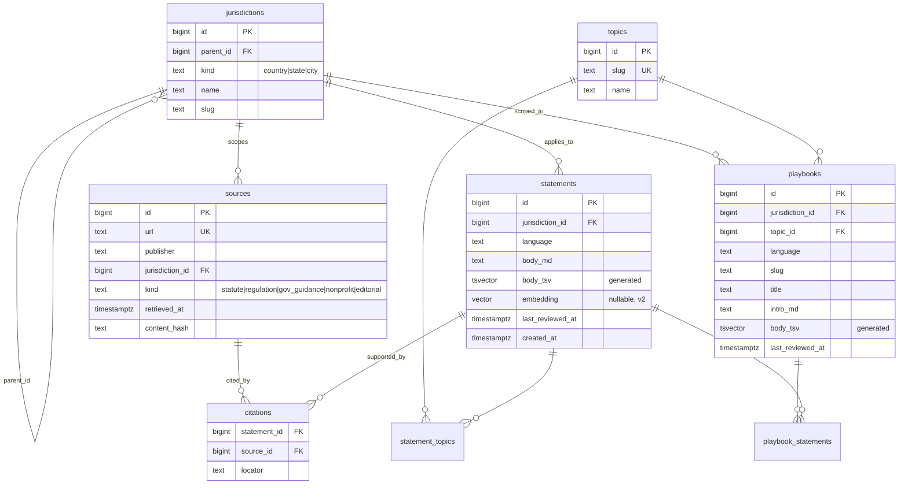

# Tenant Rights — Design Doc

| | |
|---|---|
| Status | Approved |
| Author | Nazanin |
| Date | 2026-04-25 |
| Scope | 2-day MVP rebuild of [bostonTenantsRights](https://github.com/Nazanin212/bostonTenantsRights) |

---

## 1. Context

Local organizations across the US help families facing housing instability — talking tenants through evictions, providing pro-bono legal review, sharing knowledge of local laws and tenants' rights. The information itself largely exists online, scattered across city statutes, state codes, gov agency pages, and a handful of nonprofit knowledge bases. The problem is **distribution and trust**: a tenant in a crisis cannot reliably find the right authoritative answer for their jurisdiction in the moment they need it.

The current site ([`index.html`](../index.html), [`boston/`](../boston), [`seattle/`](../seattle)) is a hand-edited static knowledge base — two cities, ~6 topics each, English + Spanish, ~700 lines of HTML per page with embedded CSS. It works, but every new city or topic is a hand-coded HTML file, citations are inconsistent, and there is no programmatic way to verify that a claim ties to a primary source.

This document proposes the v2 rebuild: a Go + Postgres service in which **every visible claim is traceable to a primary source**, jurisdiction is a first-class concept, and the architecture is designed so org plug-in and AI-assisted retrieval slot in without rewrites.

## 2. Goals and non-goals

### MVP goals (in scope, 2-day budget)

1. Replace hand-edited HTML with a citation-first data model in Postgres.
2. Migrate the Boston corpus into the new schema, with every statement attached to a real `sources` row (city statute, state code, or gov agency page) — not synthetic placeholders.
3. Browse experience: jurisdiction index, topic playbook page rendering inline citation chips for every statement.
4. Full-text search over statements and playbooks, scoped by jurisdiction.
5. Engineering substrate: `sqlc`, `golang-migrate`, structured logging, request IDs, healthchecks, table-driven tests, GitHub Actions CI (vet, lint, race tests against real Postgres), multi-stage Dockerfile, `compose up` working locally.
6. This design doc + 3–4 ADRs in the repo.

### Explicitly non-goals for MVP

- **Auth / accounts.** End-state product has logged-in tenants; MVP is anonymous browsing.
- **Org accounts or org-submitted content.** Architectural seam preserved; no UI/flow built.
- **Wizard / situation routing.** Browse + search is enough to validate the substrate.
- **i18n shipped end-to-end.** `language` column exists; only English is rendered. The existing Spanish `*-es.html` files remain in the repo as raw material for v1.1.
- **More than one city.** Boston is the working corpus. Seattle stays untouched as v1.1 raw material.
- **RAG / LLM Q&A.** Nullable `embedding` column added to `statements` so this is a v2 drop-in, not a migration.
- **Live deploy.** A working Dockerfile and `compose.yaml` is the deliverable. Fly.io / Railway is documented but not executed.

The justification for the cuts: the project's resume signal lives in *the citation guarantee, the schema, and the engineering hygiene*, not in feature breadth. One city done excellently with every claim cited is a stronger story than two cities with shaky citations.

## 3. Glossary

- **Jurisdiction** — a node in a hierarchy: country → state → city. A tenant in Boston inherits Boston + Massachusetts + federal rules. Stored in one self-referential table.
- **Source** — a credible, citable document. Has a URL, publisher, jurisdiction, retrieval timestamp, content hash, and a `kind` enum (`statute | regulation | gov_guidance | nonprofit | editorial`). The hash lets us flag silent upstream changes. The `editorial` kind represents the site itself as the authority — used for objective practical guidance that is accurate but not derivable from a single statute (e.g. "send all landlord communication via certified mail"). One canonical `editorial` source row is seeded at migration time; all such statements cite it.
- **Statement** — an atomic, citable claim shown to the user. Examples: "Massachusetts requires habitable heat of at least 68°F from September 16 through June 14." Every statement links to ≥1 source via `citations`. **The unit of trust.**
- **Playbook** — an ordered composition of statements plus connective markdown, scoped to (jurisdiction, topic, language). What the user actually reads.
- **Citation** — the join row between a statement and a source. Carries a `locator` string (e.g. statute section number or anchor) so the link in the UI lands on the right paragraph.

## 4. User journeys (MVP)

1. **Browse:** tenant lands on `/`, picks a jurisdiction, picks a topic, reads the playbook. Each statement renders a small superscript citation chip; clicking it deep-links to the source URL + locator.
2. **Search:** tenant types a phrase ("notice to quit Boston") into a search box, gets ranked results across statements and playbooks, filterable by jurisdiction.

That is the entire MVP UX. No wizard, no account, no chat.

## 5. Architecture overview

A single Go binary serves HTML directly. There is no separate frontend, no message queue, no cache layer. A separate `cmd/ingest` CLI parses markdown-with-frontmatter into Postgres rows; it runs on demand, not on every request. This keeps the request path boringly synchronous — the resume signal is in the schema and the citation discipline, not in distributed-systems complexity that doesn't earn its keep at this scale.

### Repo layout

- [`cmd/server/main.go`](../cmd/server/main.go) — entry point, env config, graceful shutdown
- [`cmd/ingest/main.go`](../cmd/ingest/main.go) — markdown → Postgres
- `internal/config/` — env loader
- `internal/http/` — chi router, middleware, handlers
- `internal/store/` — sqlc-generated code
- `internal/content/` — frontmatter parser, markdown rendering
- `internal/search/` — search query construction
- `db/migrations/*.sql` — golang-migrate
- `db/queries/*.sql` — sqlc input
- `web/templates/*.templ` — typed templates
- `web/static/site.css` — one shared stylesheet (replaces 700-line embedded blocks)
- `content/boston/<topic>.en.md` — source-of-truth markdown
- `Dockerfile`, `compose.yaml`, `Makefile`
- `docs/DESIGN.md` (this file), `docs/ADRs/`
- `.github/workflows/ci.yml`

## 6. Data model

### Key design choices

- **Self-referential jurisdictions** make "applies anywhere" a recursive query (`WITH RECURSIVE`) instead of a denormalized mess. A query for Boston pulls Boston + Massachusetts + United States in one shot.
- **Statements are the atomic citable unit, not playbooks.** Playbooks compose statements via `playbook_statements(position)`. This means the same statement ("MA security deposits must be returned within 30 days") can appear in multiple playbooks without duplication, and a citation update propagates everywhere.
- **`body_tsv` as a generated column** with a GIN index makes search a simple `WHERE body_tsv @@ plainto_tsquery(...)` — no application-side index management.
- **`embedding vector` is nullable from day 1.** Adding pgvector and populating it later is a v2 task; no schema migration required to add RAG.
- **`content_hash` on sources** lets a future cron flag silent upstream changes (statute amended, page rewritten). Out of scope for MVP, in scope for the schema.
- **`last_reviewed_at` on statements and playbooks** makes staleness queryable. Out of MVP, but the column lands now.

## 7. API surface (MVP)

- `GET /` — landing page, lists available jurisdictions
- `GET /j/{jurisdiction}` — jurisdiction's topic index
- `GET /j/{jurisdiction}/{topic}` — playbook page, statements with inline citation chips
- `GET /search?q={query}&j={jurisdiction}&topic={topic}` — search results
- `GET /healthz`, `GET /readyz` — for ops

All HTML, server-rendered with [`a-h/templ`](https://templ.guide). No JSON API in MVP — but handlers are thin enough that adding `/api/v1/*` JSON variants later is mechanical.

## 8. Trust and citation guarantees

This is the differentiating property of the product and is enforced at three layers:

1. **Schema-level:** `citations` is a join table; the ingestion tool refuses to insert a `statement` row without at least one accompanying `citations` row (transactional check). There is no path to a citation-less statement in the database.
2. **Render-level:** the `Statement` template component takes `(body, citations[])` and panics in dev / logs an error in prod if `citations` is empty. The user-facing chip renders from real `sources.url + locator`.
3. **Content-author-level:** the markdown frontmatter schema requires a `sources:` array per file. The ingest tool fails with a non-zero exit if any statement-equivalent block lacks a source reference.

**Editorial statements.** Some objective, accurate guidance is not derivable from a single statute (e.g. "document everything in writing before escalating"). These cite a single canonical `editorial` source row seeded at migration time (`kind = 'editorial'`, publisher = "Tenant Rights editorial"). The citation guarantee is preserved — no statement is ever citation-less — but the render layer displays a gray "Editorial guidance" chip instead of a blue statute chip, so readers always know the type of authority behind each claim. Editorial statements are first-class candidates for upgrading to a real citation as the corpus matures.

This three-layer enforcement is itself a documented architectural choice (see ADR-003).

## 9. Search

- Postgres `tsvector` generated columns on `statements.body_md` and `playbooks.title || intro_md` with English text-search config.
- GIN indexes on both.
- Search handler ranks via `ts_rank_cd`, filters by jurisdiction (with the recursive ancestor expansion from §6) and optional topic.
- No external search service. If query volume ever justifies it, swap to Meilisearch or OpenSearch behind the same `internal/search` interface.

## 10. Internationalization

The schema is i18n-ready — `language` column on `statements` and `playbooks` — but only English is rendered in MVP. The existing Spanish `*-es.html` files stay in the repo and become the source material for v1.1. Language negotiation (`?lang=` override, `Accept-Language` fallback) is implemented as middleware that just sets a context value; today it always resolves to `en`.

## 11. Auth (deferred)

Not in MVP. The seam: a `User` interface in `internal/http/middleware/auth.go` resolves to an anonymous singleton today. v2 swaps the implementation for a session-cookie or magic-link backend without touching handlers. End-state vision (logged-in tenant who can save progress and get help anywhere) is sequenced in §15.

## 12. Operational concerns

- **Logging:** `log/slog` with JSON handler in prod, text in dev. Request ID middleware writes a `req_id` field on every log line.
- **Config:** env vars only (`DATABASE_URL`, `LISTEN_ADDR`, `LOG_LEVEL`, `ENV`). No config files.
- **Health:** `/healthz` returns 200 if the process is up; `/readyz` returns 200 only if a `SELECT 1` to Postgres succeeds.
- **Graceful shutdown:** SIGTERM/SIGINT triggers `http.Server.Shutdown` with a 10s deadline.
- **Backups (v1.1):** documented `pg_dump` cron and a Litestream-on-SQLite-style note for if/when scale lets us go embedded. Not implemented in MVP.
- **Observability roadmap (v1.1):** Prometheus `/metrics`, OpenTelemetry traces. Not implemented in MVP.

## 13. Testing strategy

- **Store layer:** table-driven tests against a real Postgres (CI uses `services: postgres`, local uses `compose.yaml`). Tests cover the recursive jurisdiction query, citation enforcement, and search ranking.
- **Content parser:** table-driven tests on representative frontmatter samples, including failure cases (missing source, malformed YAML).
- **Handlers:** `httptest`-based tests on the three browse routes and `/search`, asserting status codes, content-type, and that response HTML contains expected citation links.
- **Render template invariants:** unit test that asserts every `Statement` rendered without citations triggers an error.

Coverage target is not a number — it is "every behavior that, if broken, would silently violate the citation guarantee."

## 14. CI/CD

GitHub Actions `.github/workflows/ci.yml`:

- `go vet ./...`
- `golangci-lint run` (config in repo, includes `revive`, `gosec`, `errcheck`)
- `go test ./... -race -count=1` against a `postgres:16` service container with migrations applied
- `go build ./...`
- `docker build .`

No deploy job in MVP. Adding one is a follow-up PR.

## 15. Future work (sequenced)

This is the piece that turns the MVP from a one-off into a credible roadmap.

1. **v1.1 — finish the existing surface:**
    - Migrate Seattle into the new schema with citations.
    - Render Spanish playbooks (the schema already supports it; revisit `tsvector` search quality for Spanish at this point).
    - Wizard form on `/` that funnels into existing browse/search.
2. **v2 — AI-assisted retrieval over the cited corpus:**
    - Populate `statements.embedding` via an offline job.
    - `/ask` endpoint: free-form question, retrieves top-k statements by cosine similarity, asks an LLM to synthesize an answer **constrained to those statements**, renders citations on every sentence in the answer.
    - Eval harness: a fixed set of question/expected-citation pairs run on every CI build to detect regression.
4. **v2.5 — accounts:**
    - Magic-link auth.
    - Saved-progress on playbooks.
    - "Remind me in 3 days" via email.
5. **v3 — orgs plug in:**
    - `organizations` table; `org_id` FK on `sources` and `statements` (additive, no rewrite).
    - Per-org draft/publish flow with a moderation queue.
    - Optional org-branded playbooks for jurisdictions where they have domain depth.

## 16. Risks

- **Legal exposure.** The site disclaims it is not legal advice. The citation chips reinforce that — every claim points back to a primary source the user could verify themselves. Content-author guidance: never paraphrase a statute in a way that loses its qualifications.
- **Content drift.** Statutes change. Mitigated in MVP by the source-freshness worker: a periodic Go job re-fetches every `sources.url`, SHA-256 hashes the response, and flags statements whose source changed for editorial review. `last_reviewed_at` is updated on each confirmed review pass.
- **Jurisdictional gaps.** Marketing the product as "anywhere" while only Boston is populated would erode trust. UI must clearly communicate which jurisdictions have coverage.
- **Scope creep on day 2.** Mitigated by §2's explicit non-goals. If something must be added during build, something else gets cut and recorded in the doc.

## 17. Resolved design decisions

These questions were open during drafting and are now closed.

- **Scope cut.** 1 city (Boston), English only, no wizard, freshness worker in MVP. Seattle, Spanish, and the wizard are v1.1. Rationale: one city done with every claim honestly cited is a stronger story than two cities with weak citations.
- **Templating.** `templ` (not stdlib `html/template`). Rationale: compile-time type safety means the citation guarantee — no statement renders without citations — is enforced by the Go compiler, not a runtime check.
- **Search quality.** Postgres `tsvector` for MVP (English only). Acceptable for the current corpus. If Spanish ships in v1.1, revisit whether to swap to Meilisearch at that point, driven by actual search quality testing rather than speculation.
- **Hosting.** Fly.io. 1 shared-CPU machine (256MB RAM) + 1-core managed Postgres (1GB volume) ≈ $6/mo. Parallel deploy: v2 goes live at `*.fly.dev` first, DNS cutover to Fly once validated, Netlify deprecated.

## 18. Caching

Tenant-rights statutes change on the timescale of legislative amendments, not minutes. Playbook pages are anonymous and identical for all visitors. We treat rendered pages as effectively static and rely entirely on standard HTTP caching:

- `Cache-Control: public, max-age=86400, stale-while-revalidate=604800` on all browse and search routes.
- Browser and any intermediate proxy cache aggressively; the Go server only renders a page when a cache miss reaches it.
- `cmd/ingest` issues a CDN cache purge for affected URLs after a successful content update (a no-op until a CDN is in front, harmless to include).

No background refresher, no Redis, no in-process cache in the MVP. Add a CDN (Cloudflare free tier is sufficient) when real traffic justifies it; this is the only change needed since the headers are already correct.

## 19. Deploy and migration from Netlify

The current static site is live on Netlify. The new Go + Postgres service is deployed to **Fly.io** (~$6/mo: 1 shared-CPU machine at 256MB RAM + a 1-core Postgres instance with 1GB volume). The parallel-deploy approach avoids downtime:

1. Deploy v2 to `tenantrights.fly.dev` (Fly subdomain).
2. Validate manually.
3. Point the production domain's DNS at Fly.
4. Netlify site is deprecated (or left as a redirect target).

The Fly app is configured via `fly.toml` in the repo root. Secrets (`DATABASE_URL`, `LOG_LEVEL`) are set via `fly secrets set`. The Postgres instance is provisioned as a separate Fly app and attached via `fly postgres attach`.

## 20. Appendix — proposed ADRs

- **ADR-001:** Why Postgres over SQLite (multi-jurisdictional queries, full-text search, future pgvector, real ops story).
- **ADR-002:** Why server-rendered Go templates over a separate SPA (delivery speed, no JS build, accessible by default).
- **ADR-003:** Citations as a first-class data primitive, enforced at schema + render + author layers.
- **ADR-004:** How orgs slot in later without schema rewrite (additive `org_id` columns, optional join tables).
